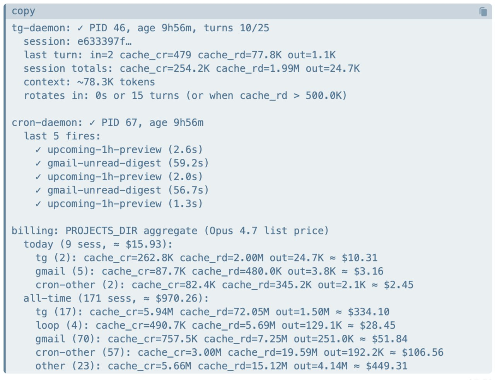

+++
title = "Escape from OpenClaw"
date = 2026-06-04
[taxonomies]
tags = ["claude", "openclaw", "obsidian"]
+++

**TL;DR**

- **What it is** — a personal assistant that's a *folder on your disk*, not an app: a very thin harness wiring Claude Code to Telegram, cron, and a knowledge base. You text it; it keeps your whole life in Markdown you own.
- **The bet** — own the one layer that doesn't churn: your data. The model evolves, skills get superseded, the harness shrinks to glue — even which CLI you run it on swaps out — but your files and chat history stay put. *Freedom isn't running the strongest model — it's that everything above your data is swappable.*
- **Why Claude Code** — open weights can't carry the judgment; ChatGPT/Gemini are closed products, not runtimes you own. Claude Code is stable, strong, ships the runtime as something you keep, has the most reliable tool-calling (and improving), and a flat subscription makes the dozens of tool-calls behind every reply essentially free.
- **The economics** — one instance bills ≈ **$970/week** at list price. It runs on a **$100/month** subscription, and I run four. The model is the only cost — so it's the one knob you turn down: a cheaper tier, or point a cheaper API like DeepSeek at the same harness to push it lower still.

<!-- more -->

y personal assistant is a folder on my disk that happens to talk back.

For the last few months I've been texting a personal assistant I built for myself. It's a Telegram bot. I message it the way I'd message a friend — "when does my wife's driver's license expire," "is this resume real," "remind the kids to practice at 7," "save this to my notes" — and it just does the thing. It books nothing to a SaaS, syncs to no cloud database, and keeps every byte of my life in Markdown files I already own. By its own honest tally it burns about **$970 a week** in model time — and that turns out to be the cheapest part of the story.

I open-sourced the scaffold as **Persona** (MIT, [github.com/gaxxx/persona](https://github.com/gaxxx/persona)). But the code is the easy part. The part worth arguing for is three claims: **why this has to be yours, why Claude Code is already enough to build it, and how little it actually takes.**

## 1. Why it has to be *yours*

Every "personal AI assistant" product wants to be the system of record. You pour your life into their database, and from then on your data lives at the intersection of someone else's uptime and someone else's business model. When they pivot, get acquired, or sunset the feature, your context goes with them.

One thing makes an assistant *yours*, and it isn't the model:

> Your data — everything else grows out of it.

**Your data.** Everything it knows about me — the family's driver's licenses, the kids' schedules, which contractor I don't trust — lives in plain Markdown in a folder I control. I can read it with my eyes, edit it in any text editor, grep it, back it up, or delete it. The assistant is disposable; the data is permanent. That's the right way round. Most products have it backwards: the assistant is permanent and your data is hostage to it.

**The skills are downstream of the data.** The things it knows how to *do* — file a document into the right place, vet a resume the way I'd vet it, route a kid's message away from my private files — are prompts and small scripts that also live in my folder. But they aren't a separate thing I own; they're *distilled* from the logs. They encode my judgment, not a vendor's defaults. When I correct it, the correction becomes a skill — so if a skill format dies tomorrow, the judgment is still sitting in the data, ready to be re-mined. Over months it doesn't get a better model; it gets *more like me*. You can't buy that, and you definitely can't rent it.

**The flywheel.** Here's the part that compounds. Because the entire log of how I talk to it is just Markdown in my folder, "improve the assistant" reduces to a sentence: *point a skill at my own logs and mine the recurring patterns.* A correction I make once becomes a rule; a need I keep hitting becomes a skill — and next time it's already there. And the loop itself is mine to shape: Claude Code ships with its own skills, but how they get used is up to me — I lean on the built-ins, bend them to fit my situation, or grow brand-new ones with a skill whose whole job is building skills (and another that finds the right one). It's your freedom, not a vendor's defaults. The ones that pay off are the ones shaped to my actual life: for the house renovation I built a skill where I describe a space and it draws the design and renders it as an HTML page I can send straight to my contractor — which has saved me hours of back-and-forth I'd otherwise spend arguing it out in words. Six days of real use hardened **twelve** such rules and skills. **The best skill is the one that fits you and your data** — which is exactly what a closed product can't give you, for a dull structural reason: you can't mine data you don't hold.

## 2. Why nothing but Claude Code

This started as a constraint. I'd been reaching the model through OpenClaw, but connecting through my own Claude OAuth was forbidden there — and it burned through far more tokens than I expected. So I did the obvious things first: went straight at the API, tried other tools like Hermes — but the same door was shut: Hermes wouldn't take my own Claude OAuth either. None of it felt like mine — and none of it made the most of the Claude Code plan I was already paying for. So I decided to build my own, on Claude Code itself, with one rule: **no SDK, no model API.** Just Claude Code, the same tool I already write code in every day, used as the runtime. No second integration to maintain, no metered API key to babysit, nothing that can be cut off from under me again.

Once I was rebuilding, the obvious question was which brain to build on — and the three tempting answers each fail in a different place:

- **Self-hosted open weights** are the most *yours* option — the weights sit on your disk, no one can ever switch them off. They fail on **capability**: the whole design leans on a model smart enough to read a pile of Markdown, decide where things belong, and collapse the "framework" into glue. Today that takes a Claude-class brain; open weights can't carry it yet. You'd save the bill and lose the judgment.
- **ChatGPT or Gemini** fail the opposite way — the brains are strong, but they're closed *products*, not runtimes you own. Their "memory" is a black box on someone's server: you can't `cat` it, can't point a skill at it, can't run the flywheel above. To bend either into this you'd be back on a model API and an SDK — exactly the access I swore off.
- **OpenClaw**, the path I'd been on, failed on **access**: it never let me connect freely through my own Claude OAuth, and it quietly ran up far more tokens than I expected — a foundation you can't freely reach, and can't predict the cost of, isn't yours.

Claude Code is the only one that clears all three at once: official and stable (no one cuts it off), strong enough to carry the judgment, and it ships the whole runtime — filesystem, MCP, skills, memory — as something you keep rather than rent. Two things sweeten it past merely clearing the bar. **Cost:** the expensive part of an agent isn't the talking, it's the dozens of tool-calling turns behind every reply — and a flat subscription prices all of that the same whether a turn fires three tools or thirty, where a metered API would bill every step. **And it improves under me:** Anthropic keeps making the tool-calling, the skills, the plugin ecosystem sharper on its own, so the substrate gets better while my data sits still — I inherit the upgrades for free. And notice what all of this makes everything above the data: swappable layers. The brain is a commodity I plug in — and can swap, including *down* to a cheaper model when a turn doesn't need the expensive one. The harness is just glue, thin enough to throw away and rewrite — and not even bound to Claude Code: the same data and skills would run on Copilot or Codex if it ever came to that. I'm on Claude Code today because its agent tool-calling is the most reliable I've used and keeps improving, not because anything underneath is welded to it. What's actually mine — the one layer that doesn't churn — is the data underneath.

> Freedom isn't running the strongest model; it's being able to swap it.

That rule turned out not to be a sacrifice. The reflex, when you decide to build something like this, is to reach for a framework — an agent graph, an orchestration layer, a vector database, a queue. I reached for none of it, and I want to be specific about why: **Claude Code and its ecosystem already give you every piece.**

- It's already a long-lived process that can **read and write your filesystem** and run shell commands. That's your runtime.
- It already speaks **MCP**, so Gmail, Calendar, and anything else plug in without glue code.
- It already has **skills** — versioned, file-based instructions the model loads on demand. That's where your judgment goes.
- It already has a **file-based memory** model worth stealing wholesale.

Once you see that, the "framework" you were about to build collapses into a few hundred lines of plumbing. There is no orchestration engine in Persona. There's no agent graph, no message bus, no embedding store. The model reads files, decides, and writes files back. Subtracting machinery *was* the design work — the discipline is noticing you don't need the thing everyone reaches for.

What you're left with is small enough to audit in an afternoon:

### Three processes sharing a folder

`tg-daemon` owns Telegram: one message in, one turn, one reply out. `cron-daemon` fires scheduled prompts — the morning mail digest, the kids' reminders; a cron is just a prompt with a clock on it. `watchdog` is a plain bash loop that restarts either one if it dies. No supervisor framework. If you can read a `while` loop, you've read the whole reliability story.

### The knowledge base is one door

Every skill that saves anything goes through a single `/kb put` command — never straight into the vault. `put` / `query` / `lint` are a fixed contract; the on-disk layout is a swappable implementation behind it. The moment more than three skills are writing files, that one door is what keeps the whole thing answerable months later.

### Memory you can `cat`

Memory is just files with frontmatter — not rows in someone else's database. The reason it's files and not embeddings is simple: when the assistant does something surprising, I can open the exact fact it acted on and delete it. And because it's only files, the memory isn't one fixed blob per account — I keep a different set for each person it talks to and each context, all inside the same install. And none of this needs fancy tooling — a personal wiki is just a folder of Markdown, and that gets you most of the way; you only reach for a skill (like the `put` / `query` door above) when you actually want one. *You cannot* `cat` *a vector.*

### And the bill is the punchline

Remember that $970. Because the assistant runs on Claude Code, the daemon can tally what every turn *would* have cost at Opus list price — and it adds up fast. This is one Persona instance's running total after about a week:

*One Persona instance, ~a week of real use: **≈ $970** of API usage at Opus 4.7 list price.*

That project does not cost me $970. It runs on my **$100-a-month** Claude Code subscription — and I run **four** of these on that same plan. No SDK, no per-token API bill, no SaaS seat. The economics aren't close: priced as metered API calls, a single one of these assistants would out-spend the entire subscription many times over in a week. The subscription is what makes "give it a long-lived process and let it read all my files" a sane thing to do instead of a budget you watch with one eye.

And because the model is the only thing being metered — the harness and the data cost nothing to run — it's also the only knob you ever need to turn. A turn that just reminds the kids to practice doesn't need the expensive brain; drop it to a cheaper model and the bill follows. The one costly part is, by design, the one part you can swap.

## 3. How: two moves

Strip away everything above and the recipe is almost insultingly short:

> Connect Claude Code to your Telegram, and put your data in the sandbox.

**1. Connect it to Telegram.** A bot token and a polling loop turn Claude Code into something you text from your phone all day. Telegram is just the doorway — the point is the assistant reaches you where you already are, instead of behind another app you have to remember to open.

**2. Put your data in the sandbox.** Point it at a folder — an Obsidian vault, or any directory — and that folder *is* the assistant's world. Your knowledge base, your skills, your memory all live inside it. The repo is the harness; this folder is the life. Clone Persona and you inherit zero facts about me — you point it at *your* folder and it becomes yours. Same code, your life.

That's the whole shape. Everything else — the three processes, the kb contract, the file-based memory — is just what those two moves look like once you've lived in them for a few months.

## 4. What it costs to be honest about

- It needs a paid Claude Code plan (or API access), Bun, a folder, and a Telegram bot. The model is the single point of failure and the single point of cost — every turn is tokens.
- The inner loop rotates the subprocess on a budget — a few hours, a turn count, or a cache-read ceiling, whichever trips first — and rebuilds memory from disk instead of holding it in an ever-growing context.
- It's a personal scaffold, not a product. The interesting parts aren't in the orchestration code — there barely is any. They're in the skills, which is exactly the point: **the harness is small so that the part that's yours can be everything.**

If you want an assistant whose data outlives it, whose skills are your judgment and not a vendor's, and whose entire machine is small enough to read in an afternoon — clone it and point it at your own folder. Same code, your life: a folder on your disk that happens to talk back.

---

Repo and a 3-minute setup video: [github.com/gaxxx/persona](https://github.com/gaxxx/persona)

